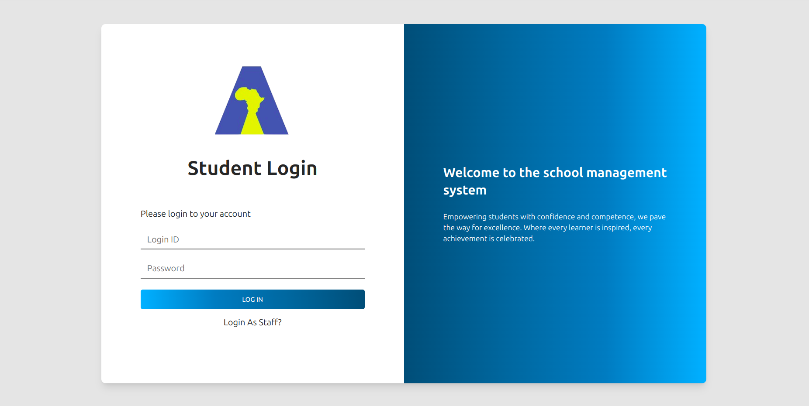

<!-- Improved compatibility of back to top link: See: https://github.com/othneildrew/Best-README-Template/pull/73 -->
<a id="readme-top"></a>
<!--
*** Thanks for checking out the Best-README-Template. If you have a suggestion
*** that would make this better, please fork the repo and create a pull request
*** or simply open an issue with the tag "enhancement".
*** Don't forget to give the project a star!
*** Thanks again! Now go create something AMAZING! :D
-->


<!-- PROJECT SHIELDS -->

[![MIT License][license-shield]][license-url]


<!-- PROJECT LOGO -->
<br />
<div align="center">
  <a href="https://aaarushascience.co.tz">
    
  </a>

  <h3 align="center">SCHOOL MANAGEMENT SYSTEM</h3>

  <p align="center">
    An awesome SMS for the controlling school daily activities
    <br />


<!-- ABOUT THE PROJECT -->
# School Management System

**Welcome to the School Management System!**  
This project is designed to simplify and streamline the daily operations of a school, making life easier for administrators, teachers, students, and parents alike. With an intuitive interface and robust features, this system ensures that managing academic and administrative tasks is efficient and effective.

### Key Features:
- **Student Management:** Easily track student enrollment, attendance, grades, and progress.
- **Teacher's Portal:** Provides teachers with tools to manage auxilliary points, assignments, and communicate with students.

- **Exam and Grade Management:** Streamlines the process of feeding results, and generating report cards.
- **Notifications and Alerts:** Keeps everyone updated with important announcements and events from the school administration.
- **Point System:** Keeps track of individual students auxilliary points and has a report on these points.

### Technologies Used:
- **Backend:** Django,PHP
- **Frontend:** HTML,TailwindCSS,Boostrap
- **Database:** MySQL

### Purpose:
This School Management System is built to foster a more organized and collaborative educational environment. Whether it's managing the academic calendar, communicating between faculty and students, or tracking student progress, this system provides a comprehensive solution to modern educational challenges.


<p align="right">(<a href="#readme-top">back to top</a>)</p>


### Built With
These are the web technologies that our team of skilled students used to build this sofisticated system from scratch


<!-- GETTING STARTED -->
## Getting Started

To get a local copy up and running follow these simple example steps.


### Installation

This is how to get the project up and running on your machine
- _**Make sure you have git installed on your computer**_

1. Clone the repo
   ```sh
   git clone https://github.com/avict18/SMS.git
   ```
2. Navigate into the Project folder and open it in your favourite editor
   ```sh
   cd SMS
   code .
   ```
3. This is the procedure you follow just beforer you start modifying your styling classes
  ```sh
  npm install tailwindcss
  npx tailwindcss -i ./styling/input.css -o ./styling/style.css
  ```

<p align="right">(<a href="#readme-top">back to top</a>)</p>


<!-- USAGE EXAMPLES -->
## Usage
This place here is going to be filled by Busagala.js
<p align="center"> login page

</p>
<p align="right">(<a href="#readme-top">back to top</a>)</p>


<!-- CONTRIBUTING -->
## Contributing

Contributions are what make the school community such an amazing place to learn, inspire, and create. Any contributions you make are **greatly appreciated**.

Don't forget to give the project a star! Thanks again!

1. Clone the project
2. Create your Feature Branch (`git checkout -b feature/AmazingFeature`)
3. Commit your Changes (`git commit -m 'Add some AmazingFeature'`)
4. Push to the Branch (`git push origin feature/AmazingFeature`)
5. Open a Pull Request


<p align="right">(<a href="#readme-top">back to top</a>)</p>


<!-- LICENSE -->
## License

Distributed under the MIT License. See `LICENSE.txt` for more information.

<p align="right">(<a href="#readme-top">back to top</a>)</p>


<!-- CONTACT -->
## The Team
Meet the team of students who made it happen

- **Aaron Victor- [@avict18](https://github.com/avict18) - aaron.vic18@proton.me**
- **Justice Busagala - [@jeel-code1](https://github.com/jeel-code1) - email@gmail.com**
- **Jesse Mbise - [@sehlby9014](https://github.com/shelby9014) - Jessembise@gmail.com**


Project Link: [https://github.com/avict18/SMS](https://github.com/avict18/SMS)

<p align="right">(<a href="#readme-top">back to top</a>)</p>


<!-- ACKNOWLEDGMENTS -->
## Acknowledgments

The production team would like to acknowledge some individuals who have made inavaluable contributions towards production of the school management system

- _**Mr. Gilbert Mtula**_
- _**Mr. Godlisten Lema**_
- _**Jeremiah Mbise**_
- _**Iram Muddasir**_
- _**Tesh Zackayo**_

And much support from the Arusha science community for making this project possible.

<p align="right">(<a href="#readme-top">back to top</a>)</p>


<!-- MARKDOWN LINKS & IMAGES -->
<!-- https://www.markdownguide.org/basic-syntax/#reference-style-links -->
[contributors-shield]: https://img.shields.io/github/contributors/othneildrew/Best-README-Template.svg?style=for-the-badge
[contributors-url]: https://github.com/othneildrew/Best-README-Template/graphs/contributors
[license-shield]: https://img.shields.io/github/license/othneildrew/Best-README-Template.svg?style=for-the-badge
[license-url]: https://github.com/othneildrew/Best-README-Template/blob/master/LICENSE.txt
[product-screenshot]: Assets/screenshot11.png
[Tailwind-css]:(https://readmebadge.vercel.app/badges/tailwind)
[Tailwind-url]: https://tailwindcss.com
[HTML]:(https://readmebadge.vercel.app/badges/html.svg)
[HTML-url]: (https://w3schools.com)
[Python]: (https://readmebadge.vercel.app/badges/python.svg)
[Python-url]: https://python.org/
[Javascript]: (https://readmebadge.vercel.app/bad)
[js-url]: (#)